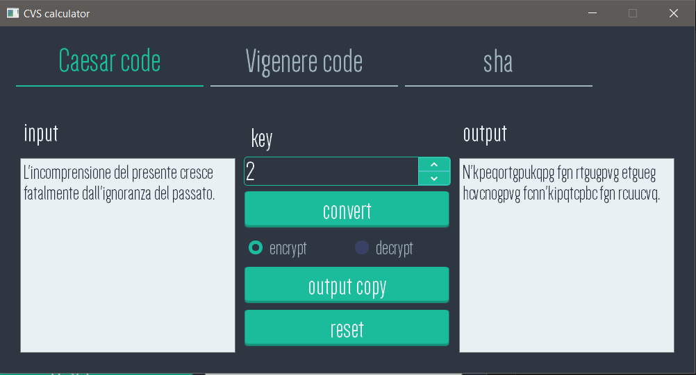
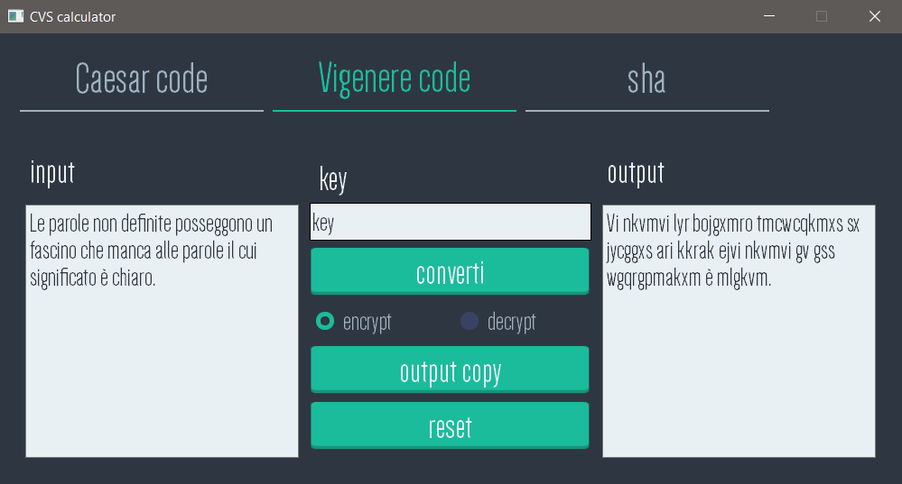
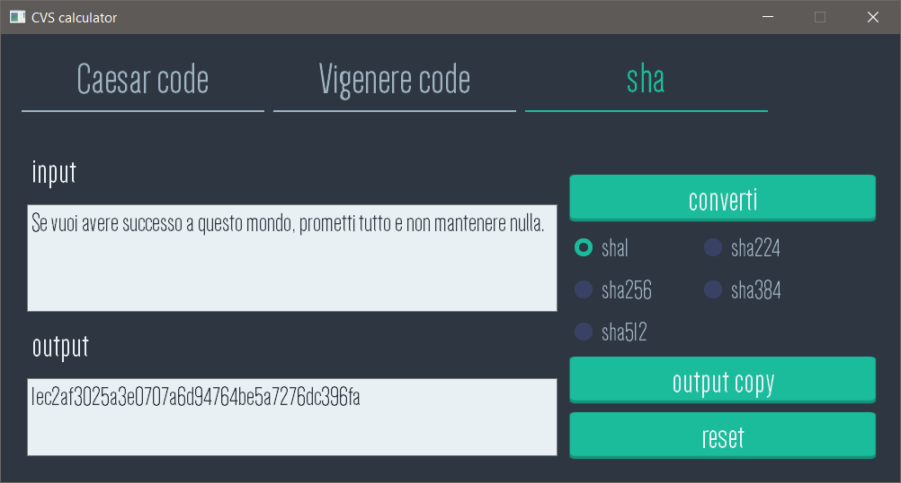

# Introduction
Universitary project to learn object oriented programming using C++.

# CVS Calc
CVS Calc is a calculator to crypt and encrypt a text using simple chipers:
* Caesar cipher view:

* Vigenere cipher view:

* SHA view:

## Requirements
The calculator must be work in:
* Linux, ssh .studenti.math.unipd.it;
* GNU g++ version 5.x (5.4.0 actual);
* Qt library version 5.x (5.5.1 actual).

## Development
To develop the calculator was used:
* Windows 10;
* MinGW 4.9.2;
* Qt library v5.5.1;
* QtCreator v4.5.2.

## How to compile and run
* Open file progetto.pro in Qt Creator;
* Use shortcut Ctrl + R to compile and run the project.

 
